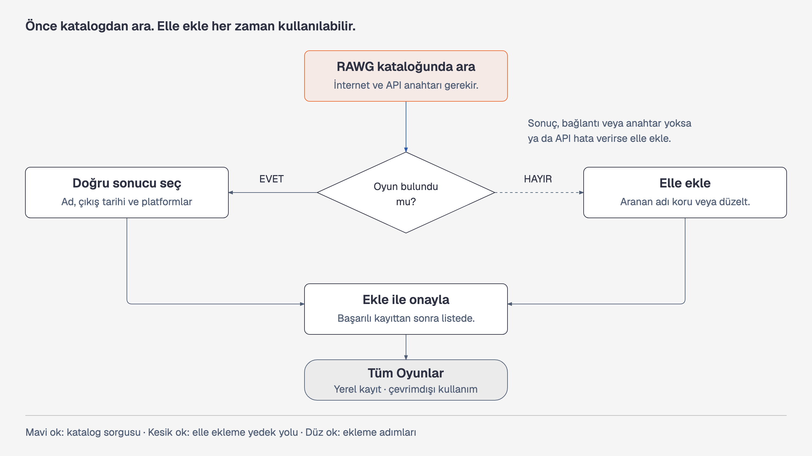

# Oyun Kütüphanesi

Oyunları, oynama durumlarını ve kişisel puanları tek yerde takip etmek için
geliştirilen yerel bir macOS masaüstü uygulaması.

İlk sürüm macOS 26 ve sonrası için SwiftUI ve SwiftData ile geliştirilecektir.
Ürün ve davranış seçimleri [ilk sürüm kararlarında](docs/ilk-surum-kararlari.md)
ayrıntılı olarak kayıtlıdır.

## Geliştirme ortamı

Xcode 27 veya sonrası ve macOS 26 SDK'sı gerekir. Projeyi Xcode ile açmak için
`Game library/Game library.xcodeproj` dosyasını açın; **Game library** şemasını
ve **My Mac** hedefini seçip çalıştırın.

Komut satırından derleme:

```sh
xcodebuild -project "Game library/Game library.xcodeproj" -scheme "Game library" -destination 'platform=macOS' build
```

## Proje belgeleri

- [Yol haritası](ROADMAP.md) ilk sürüme kadar izlenecek aşamaları ve
  tamamlanma ölçütlerini içerir.
- [Proje planı](docs/proje-plani.md) kapsamı, kullanım kurallarını, geliştirme
  adımlarını ve kabul ölçütlerini içerir.
- [Görsel anlatım](docs/oyun-kutuphanesi-gorsel.html) dört sekmeyi ve oyun
  kartlarını teknik olmayan kullanıcılar için açıklar. HTML dosyasını indirip
  tarayıcıda açın. GitHub dosya sayfası HTML'yi uygulama gibi çalıştırmaz.



## Dört sekme

| Sekme | Gösterdiği oyunlar |
| --- | --- |
| Tüm Oyunlar | Uygulamaya eklenen bütün oyunlar |
| Kütüphanem | Kütüphane olarak işaretlenen, sahip olunan oyunlar |
| Wishlist | İstek listesine eklenen oyunlar |
| Oynanacak | Daha sonra oynanması planlanan oyunlar |

Bir oyun, ilgili olduğu birden fazla sekmede görünebilir.
**Oynandı**, **Bitti** ve **Puan** oyun kartındaki bilgilerdir; ayrı sekmeler değildir.

## Oyun kartları

Oyunun altında yalnızca uygulanmış durumlar ayrı kutular halinde gösterilir.
Puan verilmişse puan da görünür. Uygulanmamış durumlar için boş kutu gösterilmez.

```text
Hollow Knight
[Kütüphane] [Oynandı] [Bitti] [Puan: 9/10]

Hades II
[Wishlist] [Oynanacak]
```

Örnekteki 10 üzerinden puanlama temsilidir. Kesin puan ölçeği henüz seçilmemiştir.

## Projenin durumu

Native macOS proje iskeleti kurulmuştur ve 1. aşamadaki kararlar tamamlanmıştır.
Oyun listesi, dört sekme, durum/puan düzenleme ve kalıcılığın kabul kontrolleri
sonraki aşamalardadır. Görsel anlatım bir taslaktır; çalışan uygulama değildir.
