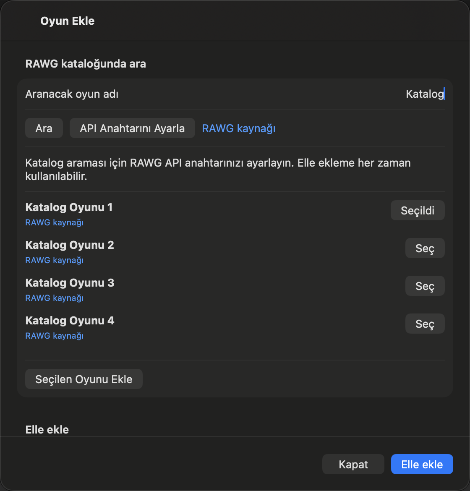
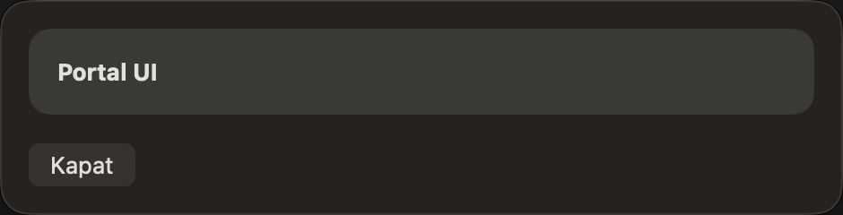

# 2. aşama doğrulama kaydı

21 Eylül 2026 tarihinde macOS 27.0 ve Xcode 27.0 üzerinde doğrulandı.
Kapsam, [yol haritasının 2. aşaması](../ROADMAP.md#2-oyun-listesini-ve-dört-sekmeyi-hazırla)
ve [içe aktarma sözleşmesidir](ilk-surum-kararlari.md#içe-aktarma-ve-elle-ekleme-sözleşmesi).
Durum ve puan düzenleme bu aşamanın dışında kalır.

## Önceki sürümde yeniden üretilen hatalar

`main` dalındaki `Game` şemasıyla bir oyun kaydedildi. Aynı SQLite deposu,
PR #13'ün başlangıç şemasıyla açılınca Core Data `134110` hatası verdi.
Zorunlu `platforms` alanının geçiş varsayılanı yoktu. Bu hata uygulamanın
açılışını engelliyordu. Alan bildirimlerindeki varsayılanlar eklendikten
sonra aynı depo başarıyla açıldı. Oyun adı, eklenme tarihi ve üç durum bayrağı
korundu; `source` değeri `manual`, `platforms` boş dizi ve `externalID` boş
olarak yüklendi.

İmzalı uygulamanın yetkilerinde sandbox etkin olduğu halde
`com.apple.security.network.client` bulunmuyordu. Katalog erişimi için
Debug ve Release yapılandırmalarına giden bağlantı izni eklendi.

Eksik veya bozuk isteğe bağlı RAWG alanlarını içeren tek oyun yanıtı için
`testMalformedOptionalMetadataDoesNotDiscardGame` eski kodda başarısız oldu.
Zorunlu kimlik ve adın doğrulanması, isteğe bağlı tarih ve platformların
eksikliğinden bağımsız tutulur.

## Sonuç

Filtresiz `xcodebuild test` çalıştırmasında 8 birim testi ve 3 native arayüz
testi geçti. Veri geçişi betiği de geçti. Test çalıştırması `f786ec8`
revizyonundaki uygulama kodunu kullandı. Release derlemesi geçti.
Release paketinde sandbox etkin ve `com.apple.security.network.client`
izni mevcut. Release uygulaması native pencerede açıldı.

Arayüz testleri bellek içi oyun deposu ve bellek içi test anahtarı kullanır.
Hosted birim testlerinin uygulama başlatıcısı da aynı izolasyonu uygular.
Bu kontroller kullanıcının gerçek koleksiyonunu veya Keychain anahtarını kullanmaz.

## Otomatik kapsam

- Birim kontrolleri, zorunlu kimliği, bozuk isteğe bağlı metadata'yı, güvenli
  kaynak bağlantılarını, aynı kimliği yeniden eklemeyi ve aynı ad onayını kapsar.
- Kayıt hatası kontrolü, başarısız eklemenin görünmediğini ve başka bir
  bekleyen değişikliğin geri alınmadığını doğrular.
- Arama kontrolleri, eşzamanlı komutları, sabit arama metnini, sayfa tekrarını,
  sonuç kimliğiyle tekilleştirmeyi ve HTTP hata sınıflandırmasını kapsar.
- Disk kontrolü, içe aktarılan kimlik ve kaynak bilgisinin yeniden açılışta
  korunduğunu doğrular.
- Native arayüz kontrolleri dört sekmeyi, elle eklemeyi, aynı adlı mevcut
  kaydı açmayı, 20 sonuçtan seçim ve onayı, erişilebilir RAWG bağlantısını ve
  başarısız kayıtta formun açık kalmasını kapsar.

## Doğrulama komutları

```sh
xcodebuild -project "Game library/Game library.xcodeproj" -scheme "Game library" -destination 'platform=macOS' build
xcodebuild -project "Game library/Game library.xcodeproj" -scheme "Game library" -destination 'platform=macOS' test
python3 docs/checks/verify-legacy-migration.py
git diff --check
```

[Veri geçişi kontrolü](checks/verify-legacy-migration.py), sabitlenmiş eski
revizyondaki modeli geçici dizinde derler. Aynı SQLite dosyasını güncel
`Game.swift` ve `RAWGService.swift` ile açar. Kalıcı kimlik, ad, tarih, üç
bayrak ve yeni alanların varsayılanları karşılaştırılır. Bu kontrol, eski
revizyonu içeren Git geçmişi, Python 3 ve Xcode komut satırı araçlarını gerektirir.

## Sınırlar

Başarılı canlı RAWG araması için geçerli kullanıcı anahtarı kullanılmadı.
HTTP yanıtları ve hata durumları yerel test yanıtlarıyla doğrulanır. Bu kanıt,
RAWG hizmetinin o anda erişilebilir olduğunu veya gerçek hesap kotasını
kanıtlamaz. Dağıtımdan önce geçerli anahtarla canlı arama ve Keychain'in
imzalı dağıtım paketindeki davranışı ayrıca kontrol edilmelidir.

Release uygulamasında Return ile arama başlatıldı. Eksik anahtar mesajı ve
aranan adın elle ekleme alanına taşınması görüldü. Tab, elle ekleme alanına
geçti ve seçili metin görünürdü. Bu Mac'in mevcut klavye ayarında Tab dolaşımı
metin alanlarıyla sınırlıydı. K19'un düğme, sonuç seçimi ve bağlantı dahil tam
klavye kabulü bu çalışmada tamamlanmadı. Native RAWG bağlantısının erişilebilirlik
ağacında bulunduğu otomatik testte doğrulanır.

K3–K9'un durum ve puan düzenleme kontrolleri 3. aşamadadır. K10–K20'nin
bütün uygulama için kabulü ve dağıtım doğrulaması sonraki aşamalarda sürer.

## Native ekran kanıtları

Katalog ekranı 20 oyunluk yerel test yanıtını gösterir. Canlı RAWG verisi değildir.
Ekran görüntüleri yalnızca uygulamanın ilgili penceresini içerir.




