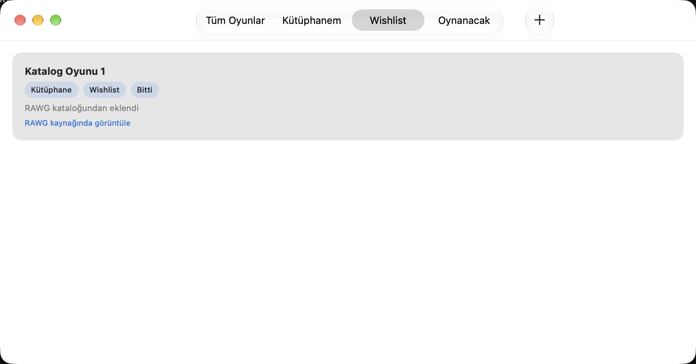

# 4. aşama — Kalıcılık ve hata durumları

## Ortam ve sınırlar

22 Eylül 2026; macOS 27.0 (26A428), Xcode 27.0 (27A266a).
Uygulamanın destek tabanı macOS 26'dır; bu çalışmada macOS 26 üzerinde ayrıca
çalıştırılmadı. Testler kullanıcı koleksiyonuna veya gerçek API anahtarına
dokunmaz. Canlı RAWG hesabı, gerçek kota ve fiziksel ağ kesintisi denenmedi;
katalog yanıtları ve bağlantı hataları deterministik test verileridir.

## Uygulanan davranış

- Ad, beş bağımsız durum ve isteğe bağlı 1–10 puan SwiftData'da açıkça kaydedilir.
- Başarısız ad/durum/puan düzenlemesi yalnızca değiştirdiği alanı geri alır.
  Hata görünür; başka bekleyen değişiklikler korunur, işlem yeniden denenebilir.
- Boş koleksiyon ve boş filtreli sekmeler ayrı açıklamalar gösterir.
- Eksik/geçersiz anahtar, kota, sunucu, bağlantı, zaman aşımı ve bozuk yanıtlar
  kullanıcıya anahtar veya istek adresi içermeyen mesajlarla iletilir.
- RAWG oturumu geçicidir (`ephemeral`); yanıt önbelleği, çerezler ve oturum
  kimlik bilgileri kalıcı URLSession deposuna yazılmaz. Arama anahtarı RAWG'nin
  HTTPS isteğinin `key` parametresindedir; servisin kendisinden gizlenmez.
- İçe aktarılan kart ve ayrıntı görünümü güvenli RAWG kaynak bağlantısı gösterir.

## Tekrarlanabilir kontroller

Sonuç: 13 birim testi ve 8 native arayüz testi geçti. İlk tam çalıştırmada
disk testinin üç kimlik karşılaştırması, aynı kalıcı URI'yi taşıyan farklı
Core Data koordinatörü nesnelerini eşit saymadı. Kontrol sıralı JSON ile
kalıcı kimlik içeriğini karşılaştıracak biçimde düzeltildi; 13 birim testinin
tamamı yeniden çalıştırıldı ve geçti. Sekiz arayüz testi ilk çalıştırmada geçti.
Release derlemesi, iki doğrulama betiği ve `git diff --check` başarılıdır.
Xcode arayüz koşusunda dahili QoS/öncelik uyarıları bildirdi; test başarısızlığı
oluşturmadı. Bunlar performans incelemesinin yerine geçen bir sonuç değildir.

Komutlar README'dedir. Test kapsamı:

| Kabul / risk | Kanıt |
| --- | --- |
| K10, K17: yeniden açılış | `testDiskReopenPreservesMixedRecordsAndOfflineEdits`: iki kayıt, kalıcı kimlikler, kaynak alanları, durumlar ve puan; ikinci açılışta düzenleme, üçüncü açılışta puanın kaldırılmış kalması. |
| K10, K17: gerçek uygulama süreci | `testDiskRelaunchAndOfflineEditing`: katalog kaydı, durum ve puan; uygulamayı sonlandırıp disk deposuyla yeniden başlatma, çevrimdışı düzenleme/elle ekleme ve tekrar başlatma. Ağ yerine hata üreten test servisi kullanılır. |
| K11, K18: başarısız kayıt | `testFailedEditsRestoreOnlyTheirFieldAndCanRetry`, `testFailedEditShowsErrorAndRevertsStatus`, mevcut ekleme hatası testi; hata görünürlüğü, alan geri alma ve tekrar kaydetme. |
| K11: boş liste | Mevcut boş form/filtreli sekme ve klavye kısayolu arayüz testleri. |
| K18: eksik veya bozuk veri | İsteğe bağlı bozuk tarih/platform alanları kabul edilir; boş ad, geçersiz kimlik, bozuk JSON reddedilir. |
| API hataları ve gizlilik | `testTransportParametersAndErrorClassification`: 401/403/429/500, eksik anahtar, bağlantı ve zaman aşımı, geçersiz yanıt; GET gövdesi yoktur, yalnızca dört izinli sorgu alanı vardır; hatalar sentetik anahtarı açığa çıkarmaz. |
| Sekme üyeliği / puan | `testTabsDependOnlyOnTheirIndependentStatus`: 32 durum birleşimi; mevcut puan doğrulama, kaldırma ve arayüz testleri. |
| Eski elle kayıtlar | `verify-legacy-migration.py`: eski şemada ayrı süreçte oluşturulan SQLite deposu güncel modelle açılır; kimlik, ad, tarih ve üç durum korunur; kaynak ve yeni kişisel alan varsayılanları doğrulanır. |
| K20: Keychain | `verify-keychain-relaunch.py`: üretim Keychain kodu yalnızca UUID test hizmeti adıyla derlenir; sentetik anahtar eklenir/güncellenir ve ayrı süreçte okunur; sonunda yalnızca bu test kaydı silinir. |

Kaynak incelemesinde uygulamanın API anahtarı için `UserDefaults`, SwiftData
alanı veya günlük yazımı yoktur. İstek sınıfı koleksiyona erişmez; kişisel
durum/puan alanlarını gönderen bir uç nokta yoktur. Ağ kaynaklı ham hatalar
uygulama katmanına taşınmadan sınıflandırılır. Bu bulgular işletim sisteminin
tüm tanılama kayıtlarının veya harici proxy'lerin denetlendiği anlamına gelmez.

## Kalan kabul sınırları

K19 için kaynak bağlantıları ve mevcut klavye kontrolleri kapsanır; bütün
arama/seçim/atıf akışının yalnızca klavyeyle ve VoiceOver ile uçtan uca manuel
kabulü bu aşamada tamamlanmış sayılmaz. K20'nin Keychain süreçler arası kontrolü
sentetik anahtarla yapılır; imzalanmış dağıtım uygulamasında gerçek kullanıcı
anahtarıyla tekrar açılış ve sistem günlükleri incelemesi 5. aşamada yapılmalıdır.
Bu sınırlar canlı RAWG kabulüyle birlikte dağıtım öncesi kontrol listesindedir.

Şema değişikliği, veri silme, bulut eşitleme veya yeni kişisel veri aktarımı yoktur.
Disk deposu ve hata enjeksiyonu anahtarları yalnızca DEBUG test modunda etkindir;
depo yolu kullanıcıdan alınmaz, geçici dizinde doğrulanmış UUID'den üretilir.

## Arayüz kanıtı

Uygulama ikinci kez kapatılıp açıldıktan sonra Wishlist: çevrimdışı eklenen
durum korunur, kaldırılan puan geri gelmez ve RAWG kaynak bağlantısı görünür.

