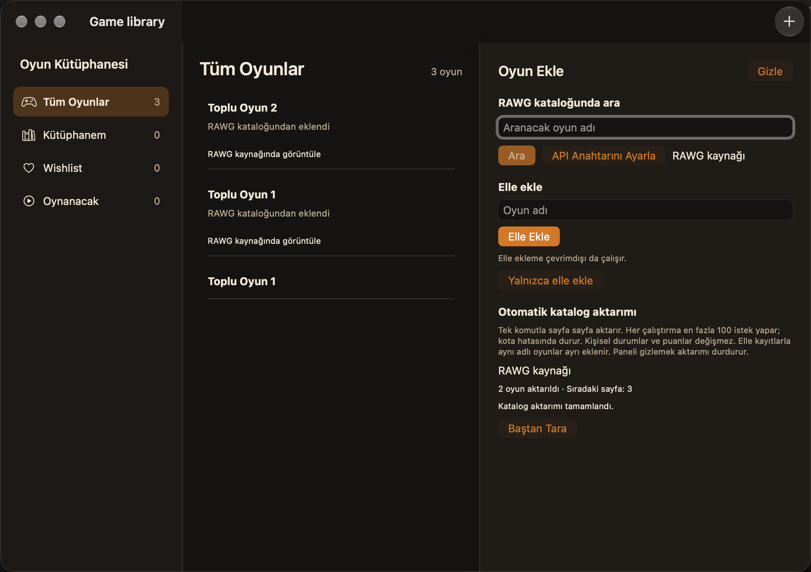

# 6. aşama — Otomatik katalog aktarımı

## Uygulama ve sınırlar

23 Eylül 2026; macOS 27.0 (26A428), Xcode 27.0 (27A266a), Apple Silicon.
Kontroller geçici/bellek depoları ve sentetik API yanıtlarıyla yapılır. Gerçek
RAWG anahtarı veya kullanıcı koleksiyonu kullanılmaz; canlı katalog/kota
kabulü, minimum macOS 26, Intel ve tam VoiceOver kabulü ayrı işlerdir.

- `Kataloğu Aktar` tek kullanıcı komutuyla en fazla 100 sayfa ilerler; sayfa
  boyutu 20, bekleme bir saniyedir. Bu bir aylık kota takipçisi değildir.
- Hatalı istek kendiliğinden tekrarlanmaz. 401/403, 429, bağlantı, zaman aşımı,
  sunucu, geçersiz yanıt ve yerel kayıt hatası çalıştırmayı durdurur.
- Durdurma veya paneli kapatma, geç gelen yanıtın kaydedilmesini engeller.
  Yeni açılışta kendiliğinden ağ isteği yoktur; devam için kullanıcı komutu gerekir.
- Yinelenen RAWG kimliği atlanır. Mevcut ad, kaynak bilgisi, durum ve kişisel puan
  güncellenmez. Aynı adlı elle kayıt otomatik birleştirilmez. Toplu aktarımı
  başlatmak aynı adlı ayrı katalog kayıtlarının eklenmesine verilen onaydır;
  tek sonuç seçme yolundaki ayrı kayıt onayı değişmez.
- `Baştan Tara` kayıtları silmeden yeniden tarar. Katalog canlı değişebildiği
  için sayfa numaralı devam, sunucunun sabit bir katalog görüntüsü garantisi değildir.

## Saklama ve gizlilik

Şemaya `CatalogImportProgress` eklenir: sıradaki sayfa, bitiş bayrağı ve yeni
eklenen kayıt sayısı. Sayfadaki oyunlar ile ilerleme işaretçisi tek SwiftData
kaydıyla atomik olarak saklanır. Ayrı ModelContext ve kapalı autosave sayesinde
başarısız sayfa geri alınırken kullanıcının bekleyen düzenlemeleri geri alınmaz.
Game şeması değiştirilmez; geçmiş elle/katalog kayıtları korunur.

İlerleme nesnesinde API anahtarı veya `next` URL'si bulunmaz. Sonraki isteğin
adresi sunucunun `next` değerinden alınmaz; sabit RAWG host'unda sayfa artırılır.
Toplu istek yalnızca `page`, `page_size` ve zorunlu `key` parametrelerini taşır;
oyun koleksiyonu, durumlar ve puanlar gönderilmez. Ham hata adresleri/logları
yazılmaz. Anahtarın istekten tamamen çıkarılması RAWG kimlik doğrulamasıyla
çelişir; yol haritasındaki gizlilik maddesi bu ayrımla açıklanmalıdır.

RAWG referansı: [resmi API açıklaması](https://rawg.io/apidocs). Kaynak
bağlantıları yeni kayıtlara yazılır; kart ve ayrıntı görünümleri bunları gösterir.

## Tekrarlanabilir kanıt

```sh
xcodebuild -project "Game library/Game library.xcodeproj" -scheme "Game library" -destination 'platform=macOS,arch=arm64' '-only-testing:Game libraryTests' test
xcodebuild -project "Game library/Game library.xcodeproj" -scheme "Game library" -destination 'platform=macOS,arch=arm64' '-only-testing:Game libraryUITests' test
python3 docs/checks/verify-legacy-migration.py
python3 scripts/package-macos.py
git diff --check
```

`CatalogImportTests` kimlik tekrarını, aynı adlı elle kaydı, boş kişisel alanları,
yeniden taramayı, diskten açılışta kota sonrası devamı, atomik kayıt hatasını,
güvenli hata mesajlarını, sayfa sınırını, iptali ve eşzamanlı çağrı engelini
kapsar. Mevcut transport testi toplu isteğin alanlarını ve host'unu doğrular.
Geçiş betiği eski şemayı yeni ilerleme modeliyle açar; ayrıca güncel Game-only
deposundan geçiş testi puan ve kaynak bilgilerinin korunduğunu denetler.

UI testi aynı adlı elle kaydı oluşturur, birinci katalog sayfasını alır,
ikinci sayfada sentetik 429 ile durur ve uygulamayı yeniden açtıktan sonra
aynı sayfadan devam eder. Gerçek RAWG'ye gitmez.

## Sonuç

Son tam koşuda **21 birim + 9 arayüz = 30 test geçti**. İlk UI koşusunda
pencere bulunamadı; test başlatıcısına etkinleştirme ve pencere bekleme eklendi.
Yeni testte ilerleme metninin macOS accessibility `label` yerine `value`
özelliğinden okunması düzeltildi. Son koşuda eski arayüz testleri de yeniden geçti.

Eski şema geçiş betiği, güncel Game-only deposundan ilerleme şemasına geçiş,
Release derlemesi, universal DMG/ZIP imza/yetki/kod kapsamı kontrolü ve
`git diff --check` başarılıdır. Paket hâlâ ad-hoc imzalı önizlemedir; bu testler
genel dağıtım veya canlı servis onayı değildir. Son küçük sekme seçimi değişikliği
Release derlemesiyle ayrıca doğrulandı.


