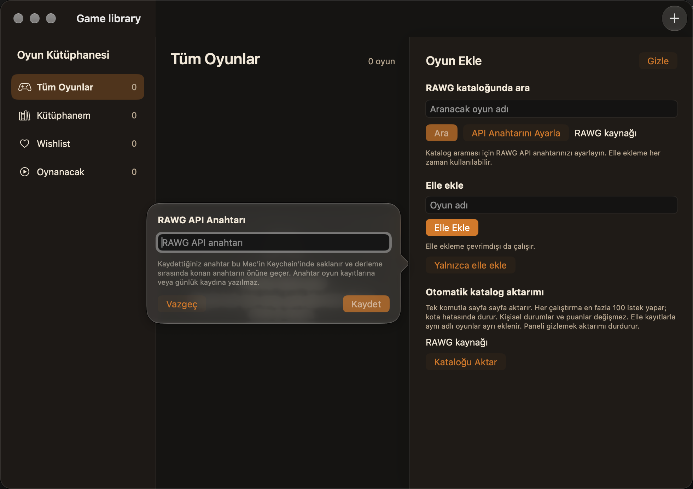

# Derleme anahtarı doğrulaması

24 Eylül 2026; macOS 27.0, Xcode 27.0 (27A266a), Apple Silicon.
[PR #26 planı](https://github.com/LeventSuleymanoglulari/GameLibrary/pull/26)
uygulandı. K1–K20 kabul durumları değiştirilmedi; canlı RAWG isteği yapılmadı.

## Davranış ve kontroller

- `RAWGKeyResolverTests`: üç test geçti. Keychain önceliği, boş Keychain'de
  kırpılmış derleme anahtarı ve iki kaynağın da boş olması doğrulandı.
  Önce testler resolver bulunmadığı için başarısız oldu. Swift 6 projesinin
  varsayılan MainActor yalıtımı nedeniyle saf fonksiyon `nonisolated` tanımlandı.
- Anahtar yükleme entegrasyonundan sonra 28 birim testi geçti; mevcut
  `testHostAndCredentialsUseOnlyMemoryStorage` testi de başarılıydı.
- `Secrets.xcconfig` olmadan Debug derlemesi geçti. Paket `Info.plist` içindeki
  `RAWGAPIKey` boştu; çözülmemiş `$(RAWG_API_KEY)` ifadesi yoktu.
- Repo dışındaki geçici proje kopyasına yalnızca `stand-in-not-a-real-key`
  yazıldı. Release ve Debug paketlerinde `RAWGAPIKey` bu sentetik değere eşitti.
  Bu kopyadaki 28 birim testi de geçti.
- `git check-ignore` özel dosyanın dışlandığını doğruladı. Dosya git tarafından
  izlenmiyor. Değişen kurulum belgelerinin yerel bağlantıları ve
  `git diff --check` kontrolü geçti.

- Sentetik anahtarlı Debug uygulamasında yeni arayüz testi geçti: test oturumu
  gömülü anahtarı kullanmadı ve anahtar formu Keychain önceliğini açıkladı.
  İlk koşudaki XCTest uzun metin sorgusu sınırı, alan özelliğiyle sorgulanarak
  düzeltildi. Son koşu bir test, sıfır hata ile tamamlandı.
  Ekran görüntüsünde açıklama tam görünür ve anahtar alanının odağı belirgindir.
- Sentetik anahtarın bulunduğu geçici proje kopyası kontrollerden sonra silindi.



## Tekrarlama

```sh
xcodebuild -project "Game library/Game library.xcodeproj" -scheme "Game library" -destination 'platform=macOS' '-only-testing:Game libraryTests' test
xcodebuild -project "Game library/Game library.xcodeproj" -scheme "Game library" -destination 'platform=macOS' '-only-testing:Game libraryUITests/Game_libraryUITests/testTestLaunchIgnoresBuildKeyAndExplainsKeychainOverride' test
git check-ignore -v "Game library/Config/Secrets.xcconfig"
git diff --check
```

Sentetik anahtar kontrolünü kişisel anahtar içermeyen ayrı bir proje kopyasında
tekrarlayın. `Secrets.example.xcconfig` örneğinden yerel dosyayı oluşturun,
sentetik değeri girin ve Debug/Release paketlerinin `Info.plist` alanını
karşılaştırın. Testler kullanıcının Keychain veya kütüphane deposunu kullanmaz.

Derleme anahtarı paket içinden okunabilir; gitignore yalnızca kaynak dosyanın
git'e eklenmesini engeller. Şema ve paketleme betiği değişmedi. İmzalama,
notarization, kurulu Release kabulü ve canlı RAWG doğrulaması bu çalışmaya dahil
değildir.
