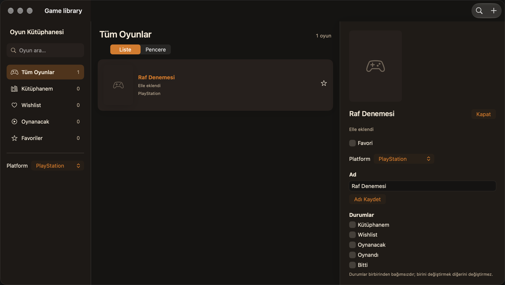
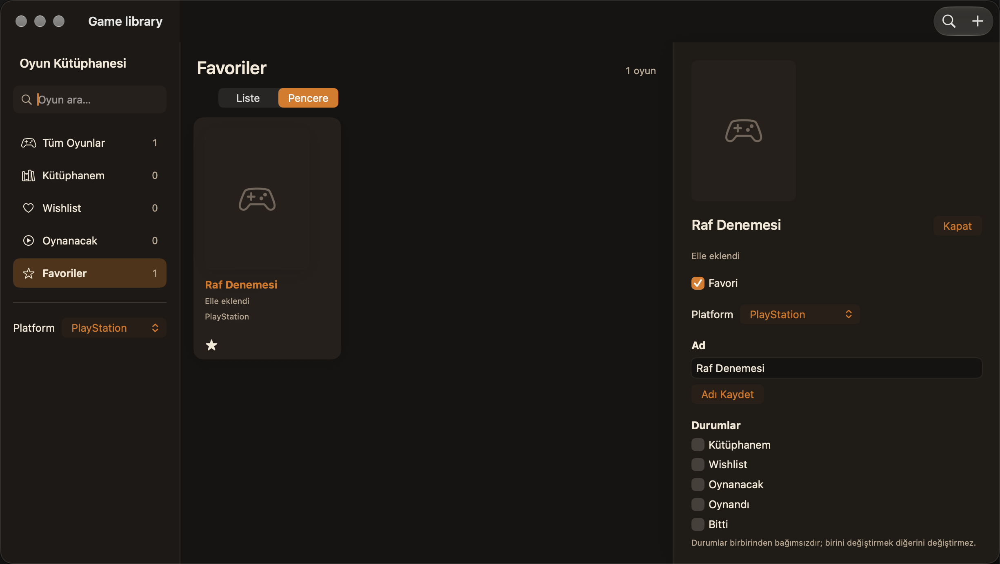

# Raf düzeni doğrulaması — 25 Eylül 2026

[İş kaydı 28](https://github.com/LeventSuleymanoglulari/GameLibrary/issues/28) için A düzeni yerel SwiftUI uygulamasında uygulandı. HTML görseli değiştirilmedi.

## Kapsam

- Favoriler bağımsız filtredir; durumları değiştirmez.
- Liste/Pencere aynı platform ve durum süzgecini kullanır. Seçili oyun sağ panelde kalır.
- Steam, Epic Games, GOG, PC, PlayStation, Xbox, Nintendo Switch, Android ve iOS seçimi oyunla saklanır; katalogdaki `platforms` alanı korunur.
- Kapak yoksa yer tutucu görünür. Liste kapağı 72, ayrıntı kapağı 128 punto genişliğindedir.
- Şemaya varsayılanı false olan `isFavorite` ve isteğe bağlı `storePlatform` eklendi.

## Kanıt

Xcode 27 ve macOS üzerinde davranış testleri geçti. Disk yeniden açma testi favori/platform değerlerini; başarısız kayıt testi favori alanının geri alınmasını kontrol eder. `python3 docs/checks/verify-legacy-migration.py` eski geçici depoyu güncel modelle açtı: kimlik ve durumlar korundu, yeni alanlar varsayılan değerlerle geldi.

`testFavoritesAndShelfViewsKeepDetailOpen` geçici bellek deposuyla geçti: favori ekleme/çıkarma, Steam ile boş sonuç, Epic Games ile eşleşme, Liste/Pencere geçişi, açık ayrıntı ve Command–1/2 kısayolları kontrol edildi. Ekran görüntüleri bu yerel testten alındı ve incelendi. `testStatusAndRatingAreEditedFromGameDetail` regresyon testi de geçti. `git diff --check` ve güncellenen belgelerin göreli bağlantı kontrolü temizdir.

## Sınırlar

Gerçek RAWG anahtarı veya kullanıcının kütüphanesi kullanılmadı. İlk açılış ve Ayarlar akışı kayıt 21 kapsamında kalır. Açık renk ve Reduce Motion davranışı bu oturumda görsel olarak doğrulanmadı. K1–K20 kabul kayıtlarının doğrulama durumu değiştirilmedi.

## Arama ve genişletilmiş platformlar

Sol raydaki arama alanı adları mevcut filtrelerle birlikte süzer. Command–F, sonuç bulunamaması, küçük harfle eşleşme, aramayı temizleme ve PlayStation seçiminin platform filtresiyle eşleşmesi aynı yerel UI testinde doğrulandı. Test geçti; ekran görüntüleri yenilendi.
